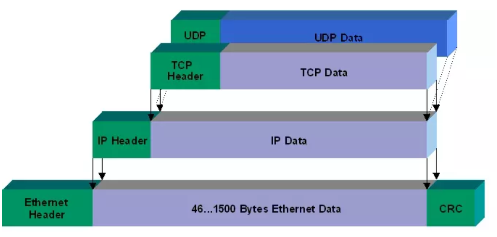
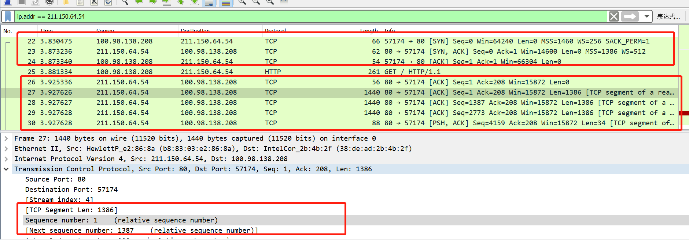

# TCP 初次总结

## 基础

- https://my.oschina.net/u/1859679/blog/1835423
- 面向连接
- 全双工
- **可靠**
- 有序
- **流量可控制** -> 滑动窗口，拥堵控制

- 网络层-ip-保证效率，不保证可靠性，完整性
- \> MTU(一般为1500字节)的网络数据，ip数据包会分片处理
- \> MSS(一般为536字节,Maximum Segment Size)的数据，tcp数据包会分片处理（完整性，下一层不会被分包）
- seq（有序性）
- ack（可靠性。包含next seq，接收窗口left cap）,接收方需要checksum，错误重发

## 三次握手

1. me->osChina:syn=1 seq=x ack=0
2. osChina->me:syn=1 seq=y ack=x+1
3. me->osChina:seq=x+1 ack=y+1

从wireshark的监控结果发现：

1. 如果是chrome，访问www.baidu.com会产生三个连接，所以发现由三个三次握手的过程，但注意port并不一样.
2. 本地使用java 的httpclient连接baidu，就只有一个连接。

## 四次握手，关闭

1. 客户端进程发出连接释放报文，并且停止发送数据。释放数据报文首部，FIN=1，其序列号为seq=u（等于前面已经传送过来的数据的最后一个字节的序号加1），此时，客户端进入FIN-WAIT-1**（终止等待1）**状态。 TCP规定，FIN报文段即使不携带数据，也要消耗一个序号。
2. 服务器收到连接释放报文，发出确认报文，ACK=1，ack=u+1，并且带上自己的序列号seq=v，此时，服务端就进入了CLOSE-WAIT（**关闭等待**）状态。TCP服务器通知高层的应用进程，客户端向服务器的方向就释放了，这时候处于半关闭状态，**即客户端已经没有数据要发送了，但是服务器若发送数据，客户端依然要接受。**这个状态还要持续一段时间，也就是整个CLOSE-WAIT状态持续的时间。
3. 客户端收到服务器的确认请求后，此时，客户端就进入FIN-WAIT-2（**终止等待2**）状态，等待服务器发送连接释放报文（在这之前还需要接受服务器发送的最后的数据）。
4. **服务器将最后的数据发送完毕后**，就向客户端发送连接释放报文，FIN=1，ack=u+1，由于在半关闭状态，服务器很可能又发送了一些数据，假定此时的序列号为seq=w，此时，服务器就进入了LAST-ACK（最后确认）状态，等待客户端的确认。
客户端收到服务器的连接释放报文后，必须发出确认，**ACK=1，ack=w+1**，而自己的序列号是seq=u+1，此时，客户端就进入了TIME-WAIT（**时间等待**）状态。注意此时TCP连接还没有释放，必须经过2∗ *∗MSL（最长报文段寿命Maximum segment lifetime）的时间后，当客户端撤销相应的TCB(**传输控制块TCB,c和s端都有**)后，才进入CLOSED状态。
5. 服务器只要收到了客户端发出的确认，立即进入CLOSED状态。同样，撤销TCB后，就结束了这次的TCP连接。可以看到，服务器结束TCP连接的时间要比客户端早一些。

## 协议内容

### 细节

1. Stream index ： the stream index is an internal Wireshark mapping to: [IP address A, TCP port A, IP address B, TCP port B]
2. rst 包 异常终止，重置包
3. MSS 和 TCP segment len。MSS是segement 的data大小，不包含headers。MSS 决定了TCP segment的最大值，并分包（chunks-块）发送。
4. seq number 是根据字节数来编排的。（segment len/mss，不包含headers）
5. 发送过程中，ack = next seq number
6. 每次包发送完毕（所有段），server 端都会进行ack，这个就是窗口的问题
7. 当这两个应用程序在进行交互式通信的时候，有时候在一端的应用进程希望在键入一个命令以后，马上就可以接收到对方的响应。在这一种情况下面，TCP就能够直接使用推送（也就是push）的操作。这一个时候，发送端TCP就会推送比特PSH设置成为1，另外一个方面还会马上进行创建一个报文段发送出去。接收TCP收到推送比特置1的报文段，大家就应该**尽快地**（也就是"推送向前"）**交付给接收应用进程**，**然而是不需要再等到整一个缓冲都已经填满了再向上交互的**。由此可见，PSH比特也有人将其称之为**急迫比特**。**PSH位就是使用来通告接收方马上将收到的报文连同TCP接收缓存里面的数据一起递交应用进程进行处理。** **发送端也会立刻清空缓存发送**

### 字段含义

URG: Urget pointer is valid (紧急指针字段值有效)

SYN: 表示建立连接

FIN: 表示关闭连接

ACK: 表示响应

PSH: 表示有 DATA数据传输，详细见细节

RST: 表示连接重置。

### 连接状态

1……tcp out-of-order（tcp有问题）

2……tcp segment of a reassembled PDU

3……Tcp previous segment lost（tcp先前的分片丢失）

4……Tcp acked lost segment（tcp应答丢失）

5……Tcp window update（tcp窗口更新）

6……Tcp dup ack（tcp重复应答）

7……Tcp keep alive（tcp保持活动）

8……Tcp retransmission（tcp 重传）

## 滑动窗口

- par协议

### 发送窗口

- 一次多发送几个片段，而不必等候ACK
- 缓存（加速，保证顺序，允许一定的乱序）

### 接收窗口

- 延迟ack（累计ack），对符合顺序的包进行确认，确认完成，发送窗口滑动
- window size 的大小控制流量
- 0窗口 应用程序并没有接收这些数据，但缓冲区满。不再发送数据

## 拥堵控制

**拥塞窗口，即发送窗口大小随拥塞率改变。**,决定滑动窗口大小
TCP目前拥塞控制主要有以下4种算法：

- 慢启动
- 拥塞避免
- 快速重传
- 快恢复

## 超时重传

## 累计ack

ack是不断递增的。如果包接收顺序不是发送顺序，会在合适的顺序包接收成功的，统一进行ack。
